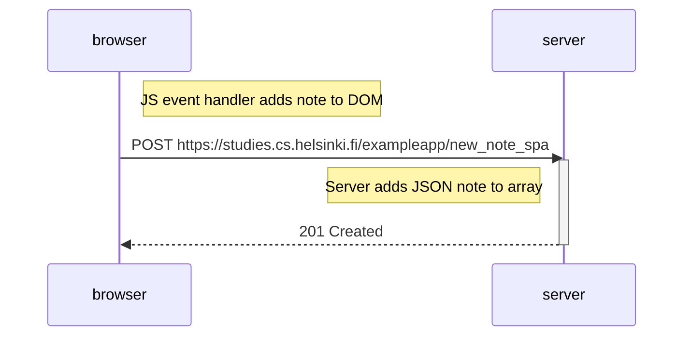

# Exercise 0.6 - New note in Single Page App diagram

User creates a new note using the single-page version of the app at https://studies.cs.helsinki.fi/exampleapp/spa

```mermaid
sequenceDiagram
    participant browser
    participant server
    Note right of browser: JS event handler adds note to DOM
    browser->>server: POST https://studies.cs.helsinki.fi/exampleapp/new_note_spa
    activate server
    Note left of server: Server adds JSON note to array
    server-->>browser: 201 Created
    deactivate server
```
